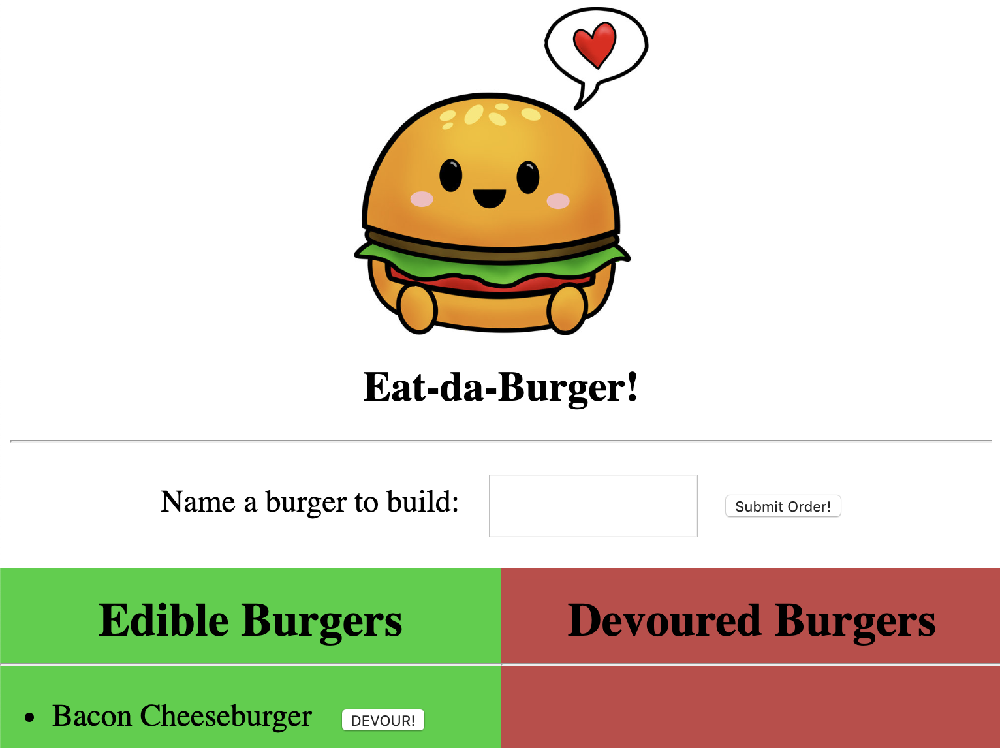

# [Eat-Da-Burger!](https://ancient-beach-11996.herokuapp.com/)

## Overview

This web application demonstrates a full-stack interaction on a Node-Handlebars-MySQL platform.

Don't let the cutest burger in the world fool you! He is a lean, mean, grillin' machine... _Wait, does that make sense?_

---

## How it works

1. Upon visit, user is presented with:

- A field where s/he can enter the name of a burger to build it.
- A list of any "edible burgers" that s/he can devour.
- A list of previously "devoured burgers".

2. If a new burger is created, it gets added to the list of edible burgers.

3. If a burger is devoured, it gets moved from the list of edible burgers to the list of devoured burgers.

4. All interactions -- creations and updates -- are reflected on a MySQL database.

5. Enough burger talk. Let the [mukbang](https://en.wikipedia.org/wiki/Mukbang) begin!

---

## Components

### Front End

- [Handlebars.js](http://handlebarsjs.com/)
- [jQuery](http://jquery.com)
- [Bootstrap](http://getbootstrap.com)

### Back End

- [Node.js](https://nodejs.org/en/)
- [NPM: Express](https://www.npmjs.com/package/express)
- [NPM: MySQL](https://www.npmjs.com/package/mysql)
- [Heroku](https://heroku.com)
